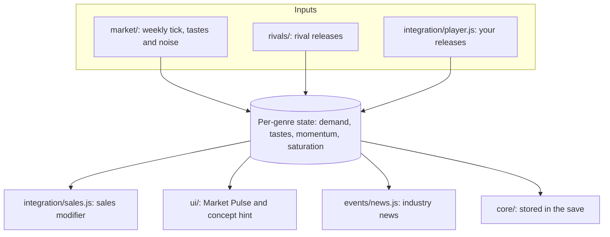

# Game Dev Tycoon: Living Industry

A game market that rises, falls and reacts to you and rival studios, plus a new title menu, quality-of-life features and optional assists.

 

---

### What it is

In vanilla Game Dev Tycoon, a topic/genre combination that sells well today sells just as well twenty years later. Living Industry gives every genre its own demand that rises and falls. Rival studios release games that push it around, and your own releases push back. Reading the market and timing a release become part of the game, and every save writes a different industry history.

It also bundles quality-of-life features and optional assists (slider marks, snap to hints, instant reviews, learn by doing and more), so you don't need three separate Workshop mods. Each one can be switched off.

Living Industry does not change topics, genres, platforms, research, staff or the vanilla development loop. It sits on top of the game you already know.

---

### Install

1. You need Game Dev Tycoon 1.7.x (Steam) and the gdt-modAPI mod that ships with the game.
2. Copy the `gdt-livingindustry` folder into the game's `mods` folder, which on Steam is `...\steamapps\common\Game Dev Tycoon\mods\`.
3. Start the game, open **Mods** from the title menu, and tick both **gdt-modAPI** and **Game Dev Tycoon: Living Industry**. Restart when asked.
4. Start a new game or load a save. Saves made without the mod work fine; they start with a neutral market and a fresh set of rivals.

#### Workshop mods it replaces

| Workshop mod | Living Industry equivalent | What to do |
|---|---|---|
| Percentager | Time allocation percentages (Display) | Disable Percentager |
| instaReview | Instant reviews (Display) | Disable instaReview |
| Learn By Doing | Learn by doing (Assists) | Disable it. While it is enabled, Living Industry's version defaults to off so skill gains don't double up. |

---

### The living market

Each of the six vanilla genres (Action, Adventure, RPG, Simulation, Strategy, Casual) has four hidden values that update every in-game week:

| Value | What it means for you |
|---|---|
| Demand | How much players want the genre right now. Neutral is 1. At 1.5 or above the genre is **HOT**; at 0.6 or below it is **COLD**. Demand settles toward the genre's current tastes, so a boom with no real shift behind it cools off and a dead genre recovers. |
| Tastes | Where demand is heading over the coming months. Every two to four years each genre's audience shifts: the genre comes into fashion, goes out of fashion, or settles back to ordinary. Shown as the trend arrow, so a genre that is HOT when you start a game is usually still hot when you ship it. |
| Momentum | Short-lived pushes from recent releases and week-to-week noise. Fades over about three months. |
| Saturation | How many games recently landed in the genre. A crowded genre grows more slowly. Fades over a few months. |

#### What moves it

- **Rival studios.** Every save generates its own roster of named competitors, each with a release cadence, a typical quality and a risk appetite. A rival hit lifts its genre's momentum, a flop drags it down, and every rival release adds saturation. Only the better-known studios make the news; small ones move the market quietly.
- **You.** Every game you release adds saturation to its genre, and larger games add more. The review score decides the rest: 9 or higher is a breakout hit and pushes momentum up hard, 8 or higher is a hit, 6 to 7.9 is average and only adds saturation, below 6 is a flop and below 4 a major flop.
- **Shifting tastes** every few years per genre, plus a little random drift.
- **The run seed.** Starting tastes, demand and the rival roster are drawn from a seed saved with each run, so the first years of every run look different.

#### What it does to you

Your release's sales are multiplied by a modifier taken from its genre's demand: up to +15% in a hot genre and down to -15% in a cold one. Quality still matters most, and a great game in a cold genre beats a bad game in a hot one. But timing is worth real money now, and chasing a boom that five rivals also chased means shipping into a crowded, cooling market.

#### Reading the market

- **Market Pulse** is a compact panel in the top-left corner with one line per genre, such as `Action  ↗ HOT`, `RPG  → COLD recovering` or `Casual  ↘ crowded`. The word is the demand level and the arrow its direction. `COLD recovering` and `HOT cooling` spell out the two cases where they point opposite ways. Click the header to collapse it, and turn on *Hover details on market lines* to see the numbers and the recent releases that moved each genre.
- **The Game Concept dialog** shows the chosen genre's Market Pulse line under the topic/genre hint, orange for hot and blue for cold.
- **Industry news** reports rival hits and flops and genres turning hot or cold as sidebar items that fade on their own; click one to read it in full. You can switch to popups or turn news off, and optionally add trend-reversal news. News about any one genre is rate limited, so the sidebar never floods.

#### Tutorial

Right after you create your company, a two-page welcome explains the market and offers *Show tips as I play* or *Don't show again*. With tips on, a one-time tip appears the first time each new screen shows up in that save: Game Concept, Development Stage, dev points, release, and your first game's effect on the market.

---

### The title screen

The title screen keeps the vanilla sunrays and logo but replaces "Click to continue..." with a menu:

- **Continue** loads your newest save. The button shows the company name and in-game date, or `autosave` if that is newest, and is hidden when there are no saves.
- **New Game**, **Load**, **Settings**, **Mods**, **High Score**, **Achievements**, **Help** and **Quit** do what they say.

The menu scales with the window, so it stays readable on large monitors and the sunrays reach all four corners. Clicking the background no longer loads a game. Esc and right-click still open the regular in-game menu while playing, where Exit is split into **Main Menu** (autosaves, then returns to this title screen) and **Exit to Desktop**. **Help** has a Living Industry section at the top.

To get the vanilla screen back, turn off *Living Industry title menu* in Settings > Living Industry. It applies the next time you start the game.

---

### Quality of life

Each feature has a toggle in Settings > Living Industry > Display. All are on by default except *Hover details on market lines* and *Also report trend reversals*.

- **Development progress in the status bar** adds a `Feature: 62% (game 34%)` line to the Fans/Cash box while developing.
- **Time allocation percentages** shows each slider's share on the Development Stage "Time Allocation (Preview)" bar.
- **Instant reviews** shows review scores at once instead of the slow reveal animation.
- **Industry news from Living Industry** picks sidebar (the default), popup or off. *Also report trend reversals* adds news when a genre flips between rising and falling.
- **Market Pulse panel**, *Hover details on market lines*, and **Living Industry overlay size** (100% to 200%) for high-resolution screens. The vanilla UI is unaffected.
- **Quiet mode** is a button that routes the chatty vanilla popups (Industry News, Platform News, New Research, Company Milestones) to the sidebar. *Vanilla popups* flips them back. Decisions and reports are untouched.
- **Living Industry tutorial** toggles the tips, and *Show tips again in this save* re-arms them.
- **Living Industry title menu** toggles the menu described above.
- **Main Menu button in the in-game menu** splits the Esc / right-click menu's Exit into **Main Menu** and **Exit to Desktop**. Main Menu writes the autosave, the same save vanilla Exit makes, and restarts into the title screen, where **Continue** picks it up. If the autosave fails you stay in the game.

---

### Assists

Assists reveal or apply the game's hidden slider rules, so a purist may want them off. One **Enable assists** master switch in Settings > Living Industry turns them all off at once (back to vanilla help) while keeping your individual choices. Each also has its own toggle:

- **Slider marks** draw `+++ / ++ / - / -- / ---` along each Development Stage slider and highlight the mark matching that slider's known hint. Click a mark to jump there. This also adds a *Snap to marks: On/Off* button to the window, remembered per save.
- **Snap to hints** is a button that sets every slider from its hint by the game's review rules: `+++` and `++` to at least 40%, `--` and `---` to the minimum. It only works on features you already have hints for. **Auto-snap** applies it every time a stage opens. This is the strongest assist, so both are off by default.
- **Remember sliders** reopens each stage with the values you last used for the same topic and genre, stored in the save.
- **Slider check on the "game is ready" screen** adds a `Slider hints: 4 ✓ met · 1 ✗ broken` line counting which known hints you met or broke. Hover for the per-feature list. It stays hidden until you know some hints.
- **Market state in the Game Concept dialog** is the Market Pulse line described above.
- **Learn by doing** gives staff a small, shrinking chance to gain Design, Technology or Research skill from the points they produce, shown as a green `+1 Design` bubble and capped at 900. It helps before training; it doesn't replace it.

Settings are app-wide and follow you across saves. Changes apply immediately, except the title menu, which applies at next launch.

---

### Saves and compatibility

- Market state, the rival roster and remembered sliders are stored in your save through gdt-modAPI, so they survive save/load and restarts.
- A save from an older Living Industry version is upgraded on load and keeps its market and rivals.
- Disabling the mod leaves your saves playable; the market data is ignored.
- The mod never blocks play. If a base-game hook it relies on is missing, for example after a game update, that one feature switches off and logs an error while the rest keeps working.

If something looks wrong, press `F12` to open devtools and look for `[Living Industry]` lines in the console. Errors always appear there. With `CONFIG.debug` on in [balance/constants.js](balance/constants.js), the first line reads `Living Industry vX.Y.Z (state vN, seed N) loaded.` followed by market, rival and news activity.

---

### Roadmap

v0.1.x tunes the market to the game's development cycle, so hot genres stay hot long enough to plan a game around, and runs a full-length balance pass. v0.1.2 then makes the market worth reading: topic trends, rival release announcements, rivals that follow your hits, and forecasts you can pay to sharpen.

After that comes the roguelite layer: **Studio Traits** that build up your company's identity, optional per-game **Project Gambits**, seeded **Industry Conditions** that make each run structurally different, rival founders with genre charts and year-end awards, drafted **Industry Opportunities**, then rivals that react to your build and a run timeline. The full plan is in [ROADMAP.md](ROADMAP.md).

---

### For developers

[main.js](main.js) loads the modules in order and initializes them. [package.json](package.json) is the mod manifest.

| Folder | What lives there |
|---|---|
| [balance/](balance/) | Tunable constants and player-setting defaults. Nothing else hardcodes numbers. |
| [core/](core/) | State shape, save/load wiring, app-wide settings store, seeded randomness |
| [market/](market/) | Weekly market tick and the shared release-effect and cause path |
| [rivals/](rivals/) | Rival studio roster and generated releases |
| [events/](events/) | Industry news conditions, delivered through the sidebar or popups |
| [integration/](integration/) | Hooks into vanilla sales, releases and staff: sales modifier, player influence, learn by doing |
| [ui/](ui/) | Title menu, in-game menu Main Menu button, Market Pulse, dev progress, slider percentages, marks and snap, release check, concept hint, instant reviews, tutorial, settings tab |

How a week of market data flows:

Every number lives in [balance/constants.js](balance/constants.js) as `LivingIndustry.CONFIG`. Set `CONFIG.debug = false` there to silence console logging before sharing a build. Each module is isolated: if a base-game function it wraps is missing, that module logs an error and switches itself off while the rest keeps running.

---

### Documentation map

| Document | What it covers |
|---|---|
| [README.md](README.md) | What the mod does, install, settings, and the code layout |
| [ROADMAP.md](ROADMAP.md) | The design vision, core tension, and planned versions |
| [balance/constants.js](balance/constants.js) | Every tunable number and setting default, with comments |
| [package.json](package.json) | Mod manifest: id, version, entry point |
